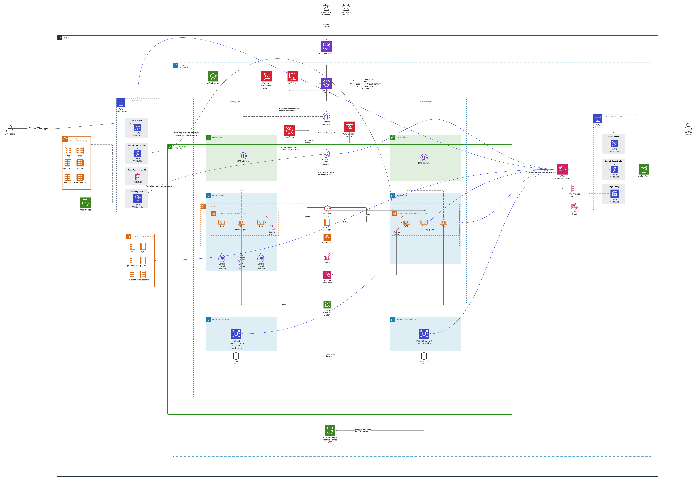
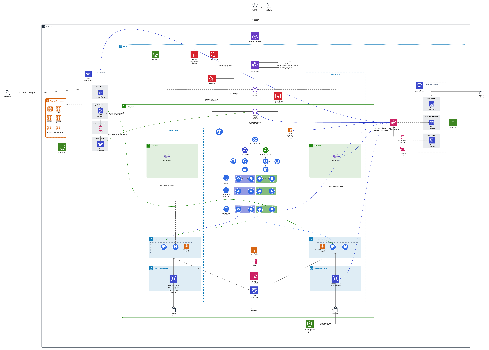

### Notes
*Please do not supply your name or email address in this document. We're doing our best to remain unbiased.*

### Date
Wed Nov  3 17:10:19 PDT 2021

### Location of deployed application
Instructions to deploy the stack locally with docker compose are in the dir/README.md.

### Time spent
16 h

### Assumptions made

I'm assuming

### Shortcuts/Compromises made

I architected the solution for a real-world application.

# Stretch goals attempted:

# 1. What changes would you make to the architecture diagram in order to accommodate multi-tenancy SaaS requirements?

The diagram depicts a multitenant serverless architecture using two CodePipeline pipelines; one for the infrastructure code and one for the application code.
The code is deployed to a container orchestrator solution like ECS + Fargate, or EKS + Fargate.

# Architecture description:

I tried to be as detailed as possible while designing the architecure diagram. 
The application VPC is composed of public, private and database subnets deployed accross two AZs.
One internet-facing Application Load Balancer is deployed in the public subnets load balancing requests and performing health checks to the containers running in the private subnets via EKS or ECS.

We have two CodePipeline pipelines, one responsible to deploy the infrastructure (VPC, subnets, route tables, databases, ECS/EKS Clusters, and the CI/CD pipeline), and a second CodePipeline which will do the build of the docker images, register the docker images with ECR and dispatch the deployment of the new release to  service for the application itself.

The hosting infrastructure consists of multiple services hosted in either an Amazon EKS Cluster with AWS Fargate worker nodes as data plane, or an Amazon ECS Fargate cluster.

The Developer approves a pull request in CodeCommit, which generates an event that will trigger the CodePipeline pipeline, responsible for build and deploy the new release version to ECS or EKS.
In EKS the rollout is made when the pipeline updates the Kubernetes deployment of a service.

## Deployment Strategy

I'm using Blue/Green deployment which is nativelly suported by CodeDeploy.
- Initially, the traffic is directed towards the Blue service of a given deployment (e.g. web-blue, prometheus-blue, fluentbit-blue).
- The Build stage of the CICD pipeline will create a new code version, by registering a new container revision in ECR.
- The Deploy stage will deploy the new code version in the green environment (e.g. web-green, prometheus-green, fluentbit-green).
- After the green environment is successfully tested:
    - Traffic is switched over to the green environment by updating the ALB target group.
    - The old blue environment is destroyed after a period.

## Auto Scaling
A Service Auto Scaling rule can be set up for the ECS Service. For this, one scaling policy has to be created by selecting one ECS service metric (ECSServiceAverageCPUUtilization, ECSServiceAverageMemoryUtilization or ALBRequestCountPerTarget) and setting a service threshold, as well the maximum number of tasks.
If using AWS EKS and Fargate, we have to deploy a Kubernetes Cluster Autoscaler to automatically add more nodes. The EKS Control Plane uses the EKS Fargate profile associated to the EKS cluster to provision new Fargate nodes when required by the Cluster Autoscaler.

## Database Layer
We can use an Multi-AZ Amazon RDS for PostgreSQL. Optionally we could set up extra Read Replicas for off-load read only queries.
For the multi-tenant data isolation, we can setup data partitioning with PostgreSQL Row Level Security (RLS)
Optionally, we could do some database caching by using Amazon Elasticache for Redis.

## Web Application Firewall

We can leverage AWS WAF to protect our application from common web exploits.
WAF is a web application firewall that helps protect our APIs against common web exploits and bots that may affect availability, compromise security, or consume excessive resources.

## Encryption

We can use AWS Certifate Manager to generate certificates for encryption of data in transit in the Application Load Balancers, and for data at rest we could leverage AWS KMS keys to encrypt data in S3 and ESB volumes.

## CDN

Utilizing Amazon CloudFront distributions to cache objects to Edge Locations for lower latency. We could set up a CloudFront distribution to cache the logs generated by the containers as well.

# 2. Roll-out plan with necessary steps to go live

1. User manualy deploys the initial CloudFormation template containing the Infrastructure CodePipeline.

2. The infrastructure CloudFormation template resides in the Infrastructure Pipeline and will be used to deploy the infrastructure.

One we have the Application Pipeline in place, developers can push the code to the CodeCommit repository, which will trigger the CI/CD process with CodePipeline, which in turn will use CodeBuild and CodeDeploy.

3. For the ECS solution, a new tenant will be added by creating new infrastructure (subnets, loadbalancer, target groups, via the infrastructure pipeline.)
   For the EKS solutions, multi-tenancy can be achieved by leveraging namespaces and Platform-as-Code approach to build a multi-tenant SaaS solution in the EKS Control Plane, and rolling out a new deployment to that namespace via CodePipeline Blue Green deployments. A multi-tenant Kubernetes as a service solution like Rancher could be adopted as extended solution to deploy multiple containers separated by namespaces.

4. For the database layer a RDS PostgreSQL with Row Level Security enabled provides isolation policies at the database level. In this design, all tenant data sits side-by-side, but each table or view contains a partitioning key (usually the tenant identifier), which is used to filter the data.

## What do you wish you could have done better?

I wish I had more time to create the CloudFormation templates, and implement the solution in a Sandbox environment.

# Instructions to run assignment locally

To deploy the developed Docker compose file docker-compose.yml containinig the containerized applications you should run:

`$ cd devops-autoincrementing-integers-master/`

`$ rm -f tmp/pids/server.pid -&& docker compose up`

One can access the rails API via the nginx reverse proxy by accessing:

http://localhost:8080/ in the developer station, or https://localhost for SSL using self-signed certificates.

The Prometheus metric server can be accessed on http://localhost:9090.
The Grafana service allows us to visualize the API metrics collected by prometeus in a dashboard. You can access the Grafana interface at http://localhost:3500 (user: admin password: admin).

The fluentbit log stream is being streamed to the Elasticsearch container, and data can be visualized in the kibana container under the 'fluentbit' index -- the index has to be created in the kibana interface at http://localhost:5602.
If you want to stream the log to the HTTP endpoint example.com, uncoment the section in the fluent-bit.conf file:

To stop the execution press CTRL+C, or docker compose down in a new shell.

# What did you not include in your solution that you want us to know about?
Were you short on time and not able to include something that you want us to know
about? Please list it here so that we know that you considered it.
# Other information about your submission that you feel it's important that we know if applicable.

I've coded only the development version via the docker-compose.yml file. I had only architected the production-grade deployment diagram, but not coded the infrastructure itself due to time constraints.

# Your feedback on this technical challenge
Interesting challenge with modern approaches to software delivery. 
